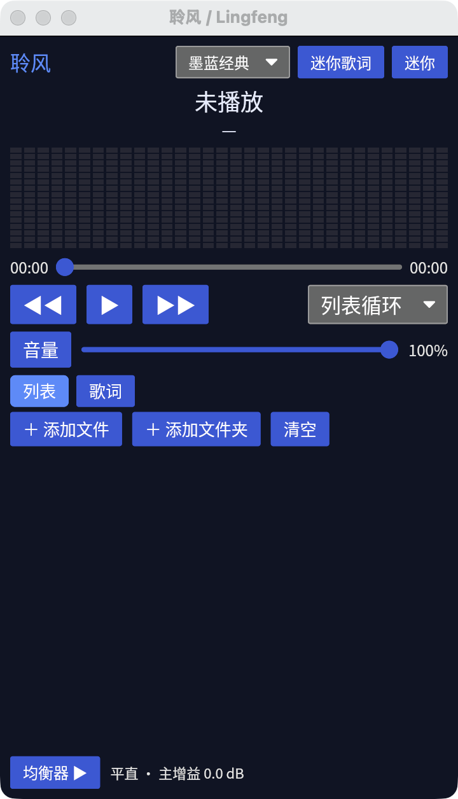

# 聆风 / Lingfeng

> 跨平台音乐播放器（致敬千千静听经典交互范式），基于 **Rust 2021** 与 **iced 0.13**。



## ✨ 特性一览

- **千千静听经典经典竖窄界面**：高宽比 ≥ 1.6 的经典七分区单列布局（默认 340×640），保留复古操作手感与低桌面占用。
- **纯 Rust 音频流流水线**：
  - **Symphonia 0.5**：解码 MP3、FLAC、WAV、Vorbis 等主流音频格式。
  - **Rubato 0.15**：高质量音频重采样（源率 → 设备首选率）。
  - **自研 10 段 RBJ Biquad 均衡器**：峰值滤波 + 主增益平滑调节。
  - **RustFFT 6.1**：实数 FFT 分析与对数分块，驱动 16 段分段式 LED 频谱柱状图实时跳动。
  - **CPAL 0.15**：拉模式音频流输出，音频与频谱共用同一份处理后 PCM，零二次解码开销。
- **动态同步 LRC 歌词**：
  - 支持 UTF-8 与 GB18030/GBK 编码自动回退识别。
  - 精准时间戳匹配与高亮平滑滚动，支持 ±500ms 动态偏移微调。
  - 独立置顶的**桌面迷你歌词窗口**。
- **播放列表与四种循环模式**：
  - 列表循环、单曲循环、随机播放（洗牌周期内不重复）、顺序播放。
  - 临时插播优先队列（Queue）。
  - 本地音频文件/文件夹导入与元数据异步解析（Lofty）。
- **个性化与系统集成**：
  - 经典多套配色主题皮肤（内置「墨蓝经典」、「暖橙怀旧」），支持 JSON 自定义皮肤。
  - 系统托盘常驻（tray-icon + muda），关闭窗口最小化到托盘，支持后台快捷控制。
  - 内嵌开源中文字体（Noto Sans SC），开箱即用，无任何跨平台豆腐块 (tofu) 乱码。

## 📦 架构与分层

代码采用 MVU 架构，纯逻辑与 GUI 层完全解耦：

- **纯逻辑层**（音频 DSP、LRC 解析、播放列表、频谱算法、配置持久化）：脱离 GUI 独立编译与毫秒级单测。
- **GUI 层**（`gui` feature）：基于 `iced 0.13` 的 `iced::daemon` 多窗口架构。

详细设计与实现细节请参阅：
- [系统架构与实现蓝图](docs/ARCHITECTURE.md)
- [类图与数据模型](docs/class-diagram.mermaid)
- [核心时序图](docs/sequence-diagram.mermaid)
- [产品需求文档 (PRD)](docs/PRD.md)
- [Agent 开发与协作指南](AGENTS.md)

## 🚀 快速开始

### 依赖环境

- Rust 1.75+ (推荐最新稳定版)
- OS: macOS / Linux / Windows

### 运行应用

```bash
# 启动完整 GUI 播放器
cargo run --release
```

### 运行测试

```bash
# 1. 秒级运行纯逻辑测试（无需加载 GUI，适合高频单测开发）
cargo test --lib --no-default-features

# 2. 运行完整测试套件（含 GUI / 布局测试）
cargo test
```

## 📄 许可证

- 源码协议：MIT License
- 字体资源：`assets/fonts/NotoSansSC-Regular.otf` 遵循 SIL Open Font License 1.1。
