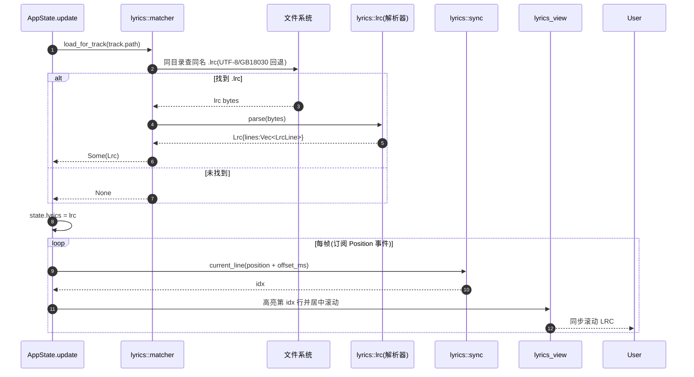
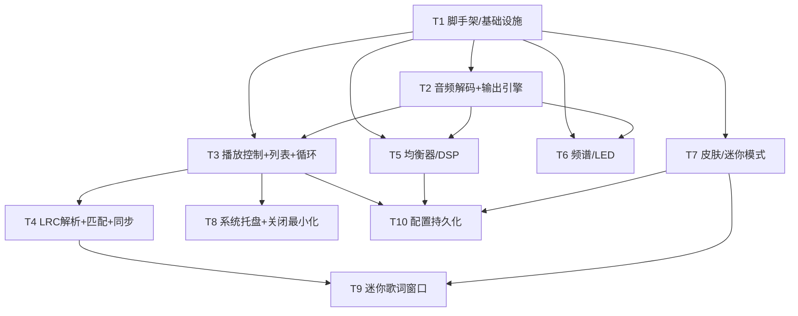
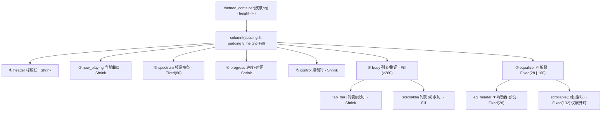
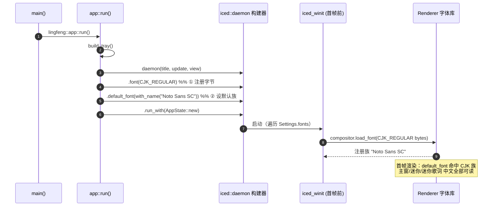
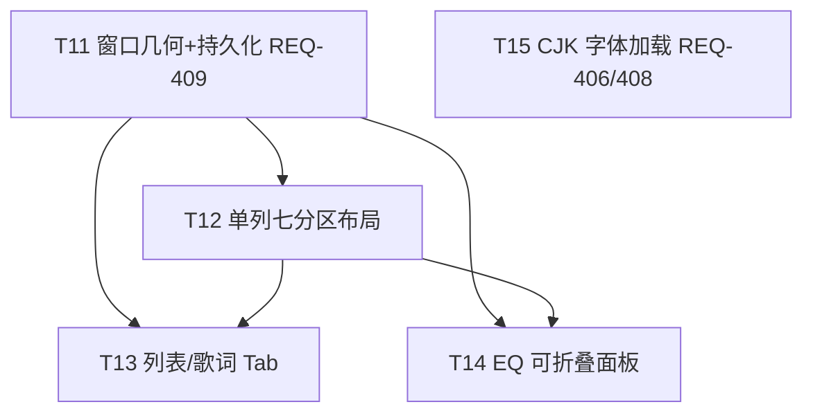

# 聆风 / Lingfeng 播放器 — 系统架构设计 + 任务分解

> 文档类型：实现蓝图（Architecture + Task Breakdown）
> 面向对象：工程师（严格按任务列表编码）、QA
> 作者：架构师 高见远（Gao）
> 配套图：`class-diagram.mermaid`（类图）、`sequence-diagram.mermaid`（时序图）

---

## 0. 核心选型决策摘要（结论先行）

| 维度 | 决策 | 一句话理由 |
|------|------|-----------|
| 框架 | **iced 0.13**（MVU，`application` + 多窗口 `window::Id`） | 纯 Rust、跨平台一致、订阅模型天然适配音频异步事件 |
| 解码 | **Symphonia 0.5**（关闭默认特性，按需开启 mp3/flac/wav/vorbis） | 纯 Rust 多格式、无系统依赖、可逐包取 f32 PCM |
| 输出 | **cpal 0.15** 自建 `OutputStream` + `data_callback` 拉模式 | 在回调里完全掌控 PCM 流，DSP/频谱挂载点自由 |
| 音频后端 **最终结论** | **Symphonia 解码 → cpal 输出（拒绝 rodio 一体化）** | rodio 的 `Source` 链式抽象**无法在输出同时并行抽取 PCM 做 FFT**，且自带 EQ 能力弱、版本波动大 |
| DSP/均衡器 | 自建 **Biquad IIR（RBJ 峰值滤波器）×10 段串联 + 主增益** | 插在 PCM 链上，实时改系数无爆音 |
| 频谱 | **rustfft 实 FFT（R2C）+ 对数分块 → LED 分段**，经 `crossbeam` 通道推给订阅 | 与输出共用同一份已处理 PCM，零额外解码 |
| 重采样 | **rubato 0.15** 源率 → 设备首选率 | cpal 设备采样率与音源不一致时必须重采样 |
| 状态管理 | 单一 `AppState`（`iced::Application`），消息枚举 `AppMessage` | MVU 集中状态，订阅把音频时钟/频谱/托盘事件抛回 `update` |
| 托盘 | **tray-icon 0.20 + muda 0.16**（独立于 iced/winit，自带 NSStatusItem） | iced 无原生托盘；macOS `NSStatusItem` 合法且无需特殊权限 |
| 持久化 | `dirs` 配置目录 + `serde_json` 落盘 | 无外部 DB 依赖，跨平台路径一致 |

**一句话总结**：音频走「Symphonia 解码 → rubato 重采样 → Biquad EQ 链 → 频谱 tap → cpal 输出」的单条 PCM 流水线，整条链在一个 cpal 回调线程内拉模式运行；UI 线程只通过 `crossbeam` 通道接收 `AudioEvent`（位置/频谱/结束/错误）与 `TrayAction`，由 iced `Subscription` 转成 `AppMessage` 驱动 `update`。

---

## 1. 实现方案概述 + 框架选型确认

### 1.1 iced 版本与架构策略

- 采用 **iced 0.13**。启用特性：`["advanced"]`（`iced::advanced` 自定义控件）、默认含 `wgpu` 渲染器与 `canvas`、`multi-window`。
- MVU 三要素：`State(AppState) → View(state, window_id) → Message(AppMessage) → Update(state, msg) → 新 State`。
- **多窗口**：主窗口 + 迷你模式窗口 + 迷你歌词窗口，均用 `iced::window::Id` 区分；`view(&AppState, window::Id)` 按 id 返回不同布局。
- **订阅（Subscription）** 是音频/频谱/托盘接入 UI 的唯一通道，详见 1.4。

### 1.2 音频后端最终选型（明确结论）

**结论：Symphonia 解码 + cpal 输出，弃用 rodio 一体化方案。**

对比：

| 方案 | 优点 | 致命缺陷（对本案） |
|------|------|-------------------|
| rodio（解码+`Sink` 一体化） | 上手快 | `Source` 是**拉模式迭代器**，播放即消费；要在「输出同时」并行抽取 PCM 喂 FFT，只能再走一份独立解码（双倍 CPU）或改写 `Sink`，侵入性强；`rodio` 无内置 10 段参数 EQ |
| **Symphonia + cpal（自建）** | PCM 流完全在己方手中，DSP/频谱挂载点自由；EQ 系数实时改、零重解码 | 需自写播放引擎（约 1 个模块 `audio/engine.rs`）—— 但这是 P0 必须付出的可控成本 |

因此采用 Symphonia + cpal，并由 `PlaybackEngine` 持有解码/重采样/DSP/输出全链路。

### 1.3 DSP / 频谱链路如何在 PCM 上挂载

单次 cpal `data_callback` 内按帧执行：

```
解码包(Symphonia) ─▶ rubato 重采样(源率→设备率, f32 交错)
        │
        ▼
   DspChain.process(frame)
        ├─ 每声道依次过 10 个 Biquad(RBJ 峰值) 串联
        └─ × master_gain(线性)  ← 主增益，置于链尾
        │
        ▼
   SpectrumTap.push(frame)   ← 频谱采样点（与输出同一份已处理 PCM）
        │
        ▼
   data.copy_from_slice(processed)  ─▶ cpal 声卡输出
        │
        ├─ 每 ~16ms：SpectrumTap.compute() → AudioEvent::Spectrum
        └─ 每 ~250ms：PositionTracker → AudioEvent::Position
```

- **PCM 格式约定**：全程 `f32`、交错（interleaved）、声道数对齐到设备（通常 2；单声道上混为双声道）。
- **控制通道**：主线程通过 `mpsc::Receiver<EngineCommand>` 向回调下发 `Play/Pause/Resume/Seek/SetEqualizer/SetVolume`，回调在每次 `data_callback` 开头 `try_recv` 消费，避免跨线程锁。
- **音量/静音**：`Arc<AtomicF32>`（volume）+ `Arc<AtomicBool>`（muted），回调每帧读取，乘进主增益；不另起通道，最低延迟。

### 1.4 状态管理与订阅接入

`AppState` 集中在主线程；音频线程只回传事件。三条订阅：

```rust
fn subscription(&self) -> Subscription<AppMessage> {
    iced::Subscription::batch(vec![
        audio_subscription(),   // crossbeam::Receiver<AudioEvent> → AppMessage::AudioEvent
        tray_subscription(),    // crossbeam::Receiver<TrayAction> → AppMessage::TrayAction
        // hotkey_subscription(),  // P1：global-hotkey
    ])
}
```

`audio_subscription` 用 `iced::subscription::channel` 包裹一个后台线程，该线程 `recv()` `AudioEvent` 并 `yield` 成 `AppMessage::AudioEvent(ev)`；`update` 据此刷新 `AppState.spectrum` / `player.position`，触发重绘。

### 1.5 侵权规避（贯穿全案）

- 品牌名「聆风 / Lingfeng / LFPlayer」，自绘图标（原创 PNG/ICO），不使用千千静听名称/Logo/专有皮肤素材/专有解码库。
- 解码用 Symphonia（开源 MIT/Apache），频谱/均衡全自研。

---

## 2. 文件列表及相对路径

采用 **单 crate**（`lingfeng`），模块清晰分层。**P0 文件加粗**。

```
lingfeng/
├── Cargo.toml                      # 依赖与特性   [P0]
├── build.rs                        # 嵌入托盘/窗口图标资源（可选）
├── assets/
│   ├── icons/lf_icon.png           # 原创托盘/窗口图标 [P0]
│   └── skins/
│       ├── classic_dark.json       # 「墨蓝经典」内置皮肤 [P0]
│       └── warm_orange.json        # 「暖橙怀旧」内置皮肤 [P0]
└── src/
    ├── main.rs                     # 入口：iced::application(run)  [P0]
    ├── error.rs                    # LingfengError（thiserror）+ anyhow 桥接 [P0]
    │
    ├── app/
    │   ├── mod.rs
    │   ├── state.rs                # AppState 主状态 [P0]
    │   ├── message.rs              # AppMessage / TrayAction / LoopMode / EqPreset 枚举 [P0]
    │   ├── update.rs               # update() 主分发（按模块拆 handler）[P0]
    │   └── subscription.rs         # audio / tray 订阅 [P0]
    │
    ├── audio/
    │   ├── mod.rs
    │   ├── engine.rs               # PlaybackEngine：解码→重采样→DSP→输出 线程 + 命令通道 [P0]
    │   ├── decoder.rs              # SymphoniaDecoder：open→迭代产出 f32 交错 [P0]
    │   ├── resampler.rs            # RubatoResampler 封装（源率→设备率）[P0]
    │   ├── dsp.rs                  # Biquad + DspChain（RBJ 峰值滤波串联 + 主增益）[P0]
    │   ├── equalizer.rs            # Equalizer：10 段增益 + 预设 + 主增益 → BiquadCoeff [P0]
    │   ├── output.rs               # cpal OutputStream 封装 + data_callback [P0]
    │   └── events.rs               # AudioEvent 枚举（推给 UI 的事件）[P0]
    │
    ├── playlist/
    │   ├── mod.rs
    │   ├── track.rs                # Track 结构（路径/元数据/时长）[P0]
    │   ├── playlist.rs             # Playlist：列表+队列+循环模式+选曲 [P0]
    │   └── metadata.rs             # 标签读取（lofty）抽标题/歌手/时长 [P0]
    │
    ├── lyrics/
    │   ├── mod.rs
    │   ├── lrc.rs                  # Lrc 解析器：时间戳/多行/编码回退(UTF-8→GB18030) [P0]
    │   ├── matcher.rs              # 同名/同目录 .lrc 自动匹配 [P0]
    │   └── sync.rs                 # 当前句计算 + 偏移校准 [P0]
    │
    ├── visualizer/
    │   ├── mod.rs
    │   ├── fft.rs                  # rustfft 实 FFT 封装（Hann 窗 + R2C）[P0]
    │   ├── spectrum.rs             # SpectrumData + 频段对数分块映射 [P0]
    │   └── led.rs                  # LED 分段渲染（iced canvas 自定义）[P0]
    │
    ├── ui/
    │   ├── mod.rs
    │   ├── main_window.rs          # 主窗口布局（View）[P0]
    │   ├── mini_window.rs          # 迷你模式窗口 + 迷你歌词窗 [P0]
    │   ├── controls.rs             # 控制栏（播放/进度/音量/循环/均衡器选择）[P0]
    │   ├── playlist_view.rs        # 播放列表面板（增删/排序/拖拽）[P0]
    │   ├── lyrics_view.rs          # 歌词滚动面板 [P0]
    │   ├── equalizer_view.rs       # 均衡器面板（10 滑块 + 预设）[P0]
    │   ├── tray.rs                 # 系统托盘 + 菜单（tray-icon/muda）[P0]
    │   └── widgets.rs              # 自定义控件（进度条/音量条/频谱 canvas 容器）[P0]
    │
    ├── theme/
    │   ├── mod.rs
    │   ├── skin.rs                 # Skin 结构 + JSON 反序列化 + 应用 [P0]
    │   ├── theme.rs                # 内置主题常量（颜色/布局默认值）[P0]
    │   └── schema.rs               # 皮肤 JSON schema 文档/校验（REQ-405, P1）
    │
    └── config/
        ├── mod.rs
        ├── persist.rs              # 配置读写（dirs 目录 + serde_json）[P0]
        └── settings.rs             # Settings 结构（皮肤/窗口/eq/音量/关闭最小化）[P0]
```

**P0 模块覆盖自检**：F1 播放/列表/循环 → `audio/*`、`playlist/*`、`ui/controls`、`ui/playlist_view`、`app/*`；F2 歌词 → `lyrics/*`、`ui/lyrics_view`、`ui/mini_window`；F3 均衡器 → `audio/dsp`、`audio/equalizer`、`ui/equalizer_view`；F4 换肤/迷你/托盘 → `theme/*`、`ui/main_window`、`ui/mini_window`、`ui/tray`；F5 频谱 → `visualizer/*`。5 大功能 P0 全部覆盖。

---

## 3. 数据结构与接口（类图）

详见 `class-diagram.mermaid`。核心类型签名如下：

```rust
// ── 播放列表 ──────────────────────────────────────────────
pub struct Track {
    pub id: String,
    pub path: PathBuf,
    pub title: String,
    pub artist: String,
    pub album: Option<String>,
    pub duration: Duration,
    pub cover: Option<Vec<u8>>,
}

#[derive(Clone, Copy, Debug, PartialEq, Eq)]
pub enum LoopMode { Single, List, Random, Sequential }

pub struct Playlist {
    pub tracks: Vec<Track>,
    pub queue: VecDeque<usize>,        // 独立队列（REQ-102）
    pub current_index: Option<usize>,
    pub loop_mode: LoopMode,
}
impl Playlist {
    pub fn add(&mut self, path: PathBuf);
    pub fn remove(&mut self, i: usize);
    pub fn move_item(&mut self, from: usize, to: usize);
    pub fn clear(&mut self);
    pub fn next(&mut self) -> Option<usize>;   // 按 loop_mode 选下一首
    pub fn prev(&mut self) -> Option<usize>;
}

// ── 播放状态 ──────────────────────────────────────────────
#[derive(Clone, Copy, Debug, PartialEq, Eq)]
pub enum PlaybackState { Stopped, Playing, Paused }
pub struct PlayerStatus {
    pub state: PlaybackState,
    pub position: Duration,
    pub duration: Duration,
    pub volume: f32,        // 0.0..=1.0
    pub muted: bool,
}

// ── 均衡器 / DSP ──────────────────────────────────────────
#[derive(Clone, Copy, Debug, PartialEq, Eq)]
pub enum EqPreset { Flat, Pop, Rock, Classical, Vocal, Custom }

pub struct Equalizer {
    pub bands: [f32; 10],          // 各段增益 dB，默认 0
    pub band_freqs: [f32; 10],     // 31,62,125,250,500,1k,2k,4k,8k,16k
    pub master_gain_db: f32,       // 主增益
    pub enabled: bool,
    pub preset: EqPreset,
}
impl Equalizer {
    pub fn to_biquad_coeffs(&self, sample_rate: f32) -> Vec<BiquadCoeff>;
    pub fn apply_preset(&mut self, p: EqPreset);
}

pub struct BiquadCoeff { pub b0:f32, pub b1:f32, pub b2:f32, pub a1:f32, pub a2:f32 }
impl BiquadCoeff { pub fn peaking(f0:f32, fs:f32, gain_db:f32, q:f32) -> Self; }

pub struct Biquad { coeff: BiquadCoeff, x1:f32, x2:f32, y1:f32, y2:f32 }
impl Biquad { pub fn process(&mut self, x: f32) -> f32; }

pub struct DspChain { filters: Vec<Biquad>, master_gain: f32 }
impl DspChain {
    pub fn from_equalizer(eq: &Equalizer, sample_rate: f32) -> Self;
    pub fn process(&mut self, frame: &[f32]) -> Vec<f32>;  // 每声道过链+主增益
}

// ── 歌词 ──────────────────────────────────────────────────
pub struct LrcLine { pub time: Duration, pub text: String }
pub struct Lrc { pub lines: Vec<LrcLine>, pub title: Option<String>, pub artist: Option<String> }
impl Lrc {
    pub fn parse(bytes: &[u8]) -> Result<Lrc, LingfengError>;  // 含 UTF-8→GB18030 回退
    pub fn current_line(&self, pos: Duration) -> usize;
}

// ── 频谱 / LED ────────────────────────────────────────────
pub struct SpectrumData {
    pub bands: Vec<f32>,         // 已归一化 0..=1 的频段能量
    pub band_count: usize,       // 默认 32
    pub led_segments: usize,     // 每段 LED 数，默认 16
}
impl SpectrumData { pub fn to_led_levels(&self) -> Vec<u8>; }  // 每频段 0..=led_segments

// ── 皮肤 ──────────────────────────────────────────────────
#[derive(Clone, Serialize, Deserialize)]
pub struct Skin {
    pub id: String, pub name: String,
    pub colors: SkinColors, pub layout: SkinLayout,
}
#[derive(Clone, Serialize, Deserialize)]
pub struct SkinColors {
    pub bg: String, pub fg: String, pub accent: String,
    pub spectrum_low: String, pub spectrum_high: String,
}
#[derive(Clone, Serialize, Deserialize)]
pub struct SkinLayout { pub show_spectrum: bool, pub mini_size: (u32,u32), pub density: f32 }
impl Skin {
    pub fn from_json(path: &Path) -> Result<Skin, LingfengError>;
    pub fn builtin() -> Vec<Skin>;   // 内置 2 套
}

// ── 配置 ──────────────────────────────────────────────────
#[derive(Clone, Serialize, Deserialize)]
pub struct Settings {
    pub skin_id: String,
    pub close_to_tray: bool,
    pub mini_mode: bool,
    pub eq_preset: String,
    pub bands: [f32; 10],
    pub master_gain_db: f32,
    pub volume: f32,
    pub lyric_offset_ms: i64,
}
impl Settings { pub fn load() -> Settings; pub fn save(&self) -> Result<(), LingfengError>; }

// ── 音频线程 → UI 事件 ────────────────────────────────────
#[derive(Clone, Debug)]
pub enum AudioEvent {
    Position(Duration, Duration),  // (position, duration)
    Spectrum(SpectrumData),
    Ended,
    Error(String),
}
pub enum EngineCommand {
    Play(Track), Pause, Resume, Seek(Duration),
    SetEqualizer(Equalizer), SetVolume(f32), SetMuted(bool),
}

// ── 主消息枚举（iced MVU）────────────────────────────────
#[derive(Debug, Clone)]
pub enum AppMessage {
    // 播放控制
    TogglePlay, Play, Pause, Next, Prev,
    Seek(Duration), SetVolume(f32), ToggleMute, SetLoopMode(LoopMode),
    // 列表
    AddFiles, AddFolder, RemoveTrack(usize), PlayTrack(usize),
    MoveTrack(usize, usize), ClearPlaylist,
    // 音频事件（订阅回传）
    AudioEvent(AudioEvent),
    // 歌词
    LoadLyrics(PathBuf), SetLyricOffset(i64), ToggleMiniLyrics,
    // 均衡器
    SetEqualizerBands([f32; 10]), ApplyEqPreset(EqPreset), SetMasterGain(f32),
    // 皮肤/窗口
    SetSkin(String), EnterMiniMode, ExitMiniMode,
    // 托盘
    TrayAction(TrayAction), WindowClose(window::Id),
}
#[derive(Debug, Clone, Copy)]
pub enum TrayAction { PlayPause, Next, Prev, ShowMainWindow, MiniMode, Quit }

// ── 主状态 ────────────────────────────────────────────────
pub struct AppState {
    pub playlist: Playlist,
    pub player: PlayerStatus,
    pub equalizer: Equalizer,
    pub lyrics: Option<Lrc>,
    pub lyric_offset_ms: i64,
    pub spectrum: SpectrumData,
    pub skin: Skin,
    pub settings: Settings,
    pub mini_window_id: Option<window::Id>,
    pub mini_lyrics_id: Option<window::Id>,
    pub engine: Arc<PlaybackEngineHandle>,   // 命令发送端封装
}
impl AppState {
    pub fn new() -> (Self, iced::Task<AppMessage>);
    pub fn update(&mut self, msg: AppMessage) -> iced::Task<AppMessage>;
    pub fn view(&self, id: window::Id) -> Element<AppMessage>;
    pub fn subscription(&self) -> iced::Subscription<AppMessage>;
}
```

类图（`class-diagram.mermaid`）用 Mermaid `classDiagram` 表达上述类型及其关系（组合/依赖/枚举）。

---

## 4. 程序调用流程（时序图）

两条主链路见 `sequence-diagram.mermaid`。

### 链路 A：用户点击播放 → 解码 → 输出 → 频谱订阅 → UI 更新

```mermaid
sequenceDiagram
    autonumber
    actor User
    participant UI as 控制栏(iced view)
    participant App as AppState.update
    participant Eng as PlaybackEngine(音频线程)
    participant Dec as SymphoniaDecoder
    participant Res as RubatoResampler
    participant DSP as DspChain(Biquad EQ)
    participant Tap as SpectrumTap/FFT
    participant CPAL as cpal OutputStream
    participant Sub as audio_subscription
    participant View as View(重绘)

    User->>UI: 点击 ▶ 播放
    UI->>App: AppMessage::TogglePlay
    App->>App: player.state = Playing
    App->>Eng: EngineCommand::Play(track)
    Eng->>Dec: open(path)
    Dec-->>Eng: format(rate, ch, duration)
    Eng->>Res: init(src_rate, dst_rate, ch)
    Eng->>DSP: from_equalizer(eq, dst_rate)
    Eng->>CPAL: build_output_stream + play()
    loop cpal data_callback(每 ~256 帧)
        CPAL->>Eng: callback(data: &mut [f32])
        Eng->>Res: next_frame()
        Res->>Dec: decode_packet()
        Dec-->>Res: f32 samples
        Res-->>Eng: 重采样帧 [f32; ch]
        Eng->>DSP: process(frame)
        DSP-->>Eng: 处理后帧(含 EQ+主增益)
        Eng->>Tap: push(frame)
        Eng->>CPAL: data.copy_from_slice(processed)
        alt 到刷新周期(~16ms)
            Eng->>Tap: compute()
            Tap-->>Eng: SpectrumData
            Eng->>Sub: tx.send(AudioEvent::Spectrum(sd))
        end
        alt 到时钟周期(~250ms)
            Eng->>Sub: tx.send(AudioEvent::Position(pos,dur))
        end
    end
    Sub->>App: AppMessage::AudioEvent(Spectrum/Position)
    App->>View: 更新 spectrum / progress
    View-->>User: 频谱跳动 + 进度更新
    Note over Eng: 解码耗尽 → AudioEvent::Ended
    Sub->>App: AppMessage::AudioEvent(Ended)
    App->>App: 按 LoopMode 选下一首
    App->>Eng: EngineCommand::Play(next)
```

### 链路 B：加载歌曲 → 自动匹配 .lrc → 歌词同步



### 订阅如何把事件推给 update

`audio_subscription` 用 `iced::subscription::channel` 拉起一个后台线程：

```rust
fn audio_subscription() -> Subscription<AppMessage> {
    iced::subscription::channel("audio", 32, |mut output| async move {
        let rx = AUDIO_EVENT_RX.clone();   // crossbeam::Receiver<AudioEvent>
        loop {
            if let Ok(ev) = rx.recv() {
                output.send(AppMessage::AudioEvent(ev)).await.ok();
            }
        }
    })
}
```

`PlaybackEngine` 在 cpal 回调内 `AUDIO_EVENT_TX.send(...)`；托盘菜单点击则 `TRAY_EVENT_TX.send(TrayAction)`，`tray_subscription` 同理转 `AppMessage::TrayAction`。`update` 据此更新 `AppState`，iced 自动重绘。

---

## 5. 有序任务列表（T1…T10，全部 P0）

> 依赖关系：`T(n)` 标注其前置任务。每条含**源文件**、**实现要点**、**验收点**。工程师严格按此编码。

### T1 — 项目脚手架与基础设施  【P0，无依赖】
- **源文件**：`Cargo.toml`、`src/main.rs`、`src/error.rs`、`src/app/mod.rs`、`src/audio/mod.rs`、`src/playlist/mod.rs`、`src/lyrics/mod.rs`、`src/visualizer/mod.rs`、`src/ui/mod.rs`、`src/theme/mod.rs`、`src/config/mod.rs`、`assets/icons/lf_icon.png`
- **实现**：配置全部依赖与特性；`main.rs` 启动 `iced::application`；`LingfengError`（thiserror）含 `Io/Symphonia/Cpal/Serde/Json/Decode` 变体；建立空 `AppState` 与空主窗口（标题「聆风 LFPlayer」）。
- **验收**：`cargo build` 通过；运行弹出空主窗口，可正常关闭退出，无 panic。

### T2 — 音频解码 + cpal 输出引擎  【P0，依赖 T1】  (REQ-101)
- **源文件**：`src/audio/decoder.rs`、`src/audio/resampler.rs`、`src/audio/output.rs`、`src/audio/engine.rs`、`src/audio/events.rs`
- **实现**：`SymphoniaDecoder::open` 返回 `(format, iterator<f32 交错>)`；`RubatoResampler` 源率→设备首选率；`output.rs` 建 `cpal::Stream` 的 `data_callback`（拉模式：重采样→暂不过 DSP，先直通验证）；`engine.rs` 持有命令通道 `mpsc::Receiver<EngineCommand>` 与事件通道 `AUDIO_EVENT_TX`；`events.rs` 定义 `AudioEvent`/`EngineCommand`。发送 `Position` 事件。
- **验收**：MP3/FLAC/WAV/OGG 各 1 首均可解码出声，无爆音/卡顿；`AudioEvent::Position` 时间随播放增长。

### T3 — 播放控制 + 播放列表 + 循环/进度/音量  【P0，依赖 T1,T2】  (REQ-102,103,104,105)
- **源文件**：`src/app/state.rs`、`src/app/message.rs`、`src/app/update.rs`、`src/app/subscription.rs`、`src/playlist/track.rs`、`src/playlist/playlist.rs`、`src/playlist/metadata.rs`、`src/ui/controls.rs`、`src/ui/playlist_view.rs`、`src/ui/widgets.rs`
- **实现**：`AppMessage` 全枚举 + `update` 分发；`Playlist` 实现 `add/remove/move_item/clear/next/prev`（四种 `LoopMode` 选曲逻辑，随机用 `rand` 不重复）；`metadata.rs` 用 `lofty` 抽标题/歌手/时长；`controls.rs` 播放/暂停/上下首/进度条拖拽 seek/音量滑块/静音/循环模式下拉；`widgets.rs` 自定义进度条与音量条（拖拽发 `Seek`/`SetVolume`）；`subscription.rs` 接通 `audio_subscription` 处理 `Position/Ended`。
- **验收**：可增删/排序/拖拽调整顺序；四循环模式行为正确（随机不重复不遗漏）；拖拽 seek 精准跳转、时间实时更新；音量 0–100% 即时生效、静音可恢复；曲终自动按模式切下一首。

### T4 — LRC 解析 + 自动匹配 + 同步滚动  【P0，依赖 T1,T3】  (REQ-201,202,203)
- **源文件**：`src/lyrics/lrc.rs`、`src/lyrics/matcher.rs`、`src/lyrics/sync.rs`、`src/ui/lyrics_view.rs`
- **实现**：`Lrc::parse` 支持 `[mm:ss.xx]` 多时间戳、多行合并、`encoding_rs` GB18030 回退；`matcher` 在音源同目录按同名（去扩展名+.lrc）匹配；`sync::current_line(pos+offset)` 二分定位；`lyrics_view` 当前句高亮居中滚动（订阅 Position 驱动）。
- **验收**：标准 .lrc 正确解析；打开音频自动加载同名 .lrc；同步高亮误差 < 200ms；无 .lrc 时优雅留空。

### T5 — 均衡器 / DSP 音效  【P0，依赖 T1,T2】  (REQ-301,302,303)
- **源文件**：`src/audio/dsp.rs`、`src/audio/equalizer.rs`、`src/ui/equalizer_view.rs`
- **实现**：`BiquadCoeff::peaking`（RBJ 峰值）、`Biquad::process`（Direct Form II Transposed）、`DspChain::from_equalizer` + `process`；`Equalizer` 10 段（31Hz–16kHz）`to_biquad_coeffs`、`apply_preset`（流行/摇滚/古典/人声/自定义）；在 `engine` 回调把 `DspChain` 接入 PCM（替换 T2 的直通）；`equalizer_view` 10 滑块 + 预设下拉；`SetEqualizerBands`/`ApplyEqPreset`/`SetMasterGain` 经 `EngineCommand::SetEqualizer` 实时下发（改系数不重启流）。
- **验收**：各段 −12~+12dB 实时生效、听感变化明显；预设一键应用；主增益调节无削波告警（master_gain 上限钳制 + 软限幅提示）。

### T6 — 频谱 FFT + LED 渲染  【P0，依赖 T1,T2】  (REQ-501,502,503)
- **源文件**：`src/visualizer/fft.rs`、`src/visualizer/spectrum.rs`、`src/visualizer/led.rs`
- **实现**：`fft.rs` 维护 1024 点环形缓冲 + Hann 窗 + `rustfft` R2C；`spectrum.rs` 取前半频谱按对数分 32 段求能量→归一化 `SpectrumData`；`led.rs` 用 `iced::widget::canvas` 画分段 LED 竖条（颜色随高度 `spectrum_low→spectrum_high` 渐变）；引擎回调到刷新周期发 `AudioEvent::Spectrum`；暂停/静音时 `AppState` 清零或静止。
- **验收**：频谱随真实音频 60fps 实时跳动；呈现经典阶梯/LED 分段样式；暂停/静音时归零或静止；主窗口与迷你模式（简化）均显示。

### T7 — 皮肤/换肤 + 迷你模式  【P0，依赖 T1,T3】  (REQ-401,402)
- **源文件**：`src/theme/skin.rs`、`src/theme/theme.rs`、`src/ui/main_window.rs`、`src/ui/mini_window.rs`
- **实现**：`Skin` 反序列化 + 内置 2 套（`classic_dark`/`warm_orange` JSON）；`theme.rs` 默认值；`main_window.rs` 按 `skin` 上色布局；标题栏「皮肤」按钮弹选择面板（缩略+名）发 `SetSkin`；`mini_window.rs` 迷你模式窗口（`window::open`，置顶、可拖动、半透明），保留播放/切歌/进度。
- **验收**：2 套皮肤即时切换无残留错乱；可进入/退出迷你模式，核心控制保留。

### T8 — 系统托盘 + 关闭最小化到托盘  【P0，依赖 T1,T3】  (REQ-403,404)
- **源文件**：`src/ui/tray.rs`、`src/app/subscription.rs`（加 `tray_subscription`）
- **实现**：`tray-icon`+`muda` 建托盘图标与右键菜单（播放/暂停、上一首、下一首、显示主窗口、迷你模式、退出），`activate` 回调 `TRAY_EVENT_TX.send(TrayAction)`；`tray_subscription` 转 `AppMessage::TrayAction`；主窗口 `CloseRequested` 拦下：若 `settings.close_to_tray` 则隐藏而非退出（发 `WindowClose(main_id)` 仅 hide）。
- **验收**：托盘菜单各项控制生效；关闭主窗口默认最小化到托盘（可配置）；托盘退出正常。

### T9 — 迷你歌词窗口  【P0，依赖 T1,T4,T7】  (REQ-204)
- **源文件**：`src/ui/mini_window.rs`（迷你歌词小窗部分）
- **实现**：独立 `window::Id` 常驻小窗，置顶、半透明、可拖动边缘、双击恢复主窗口；显示当前歌词句（复用 `sync::current_line`），随播放滚动。
- **验收**：迷你歌词窗常驻、置顶、半透明、可拖动、显示当前歌词并同步。

### T10 — 配置持久化  【P0，依赖 T1,T3,T5,T7】  (贯穿)
- **源文件**：`src/config/persist.rs`、`src/config/settings.rs`
- **实现**：`Settings` 覆盖皮肤 id、关闭最小化、迷你模式、eq 预设/各段增益/主增益、音量、歌词偏移；启动时 `Settings::load()`（缺省给默认+内置皮肤），变更时 `save()` 到 `dirs::config_dir()/Lingfeng/settings.json`；首次运行拷贝内置皮肤 JSON 到 `…/Lingfeng/skins/`。
- **验收**：皮肤/窗口状态/均衡器/音量/关闭最小化重启后保留，无损坏文件时启动不报错。

> **P1/P2 后续**（本蓝图不展开为编号任务，供排期参考）：T11 文件夹批量导入+最近播放+全局热键(REQ-106,107)；T12 在线歌词占位/偏移校准 UI/自定义皮肤导入/频谱参数可调(REQ-205,206,304,407,504,505)；T13 ReplayGain 占位(REQ-108)；T14 皮肤格式文档化+社区生态(REQ-405)。

---

## 6. 依赖包列表（Cargo.toml 关键依赖）

```toml
[package]
name = "lingfeng"
version = "0.1.0"
edition = "2021"

[dependencies]
# ── UI 框架（MVU + 多窗口 + 自定义控件）──
iced = { version = "0.13", features = ["advanced"] }   # 窗口/订阅/canvas/window::Id

# ── 音频解码（纯 Rust，按需开启格式）──
symphonia = { version = "0.5", default-features = false,
              features = ["mp3", "flac", "wav", "vorbis", "pcm"] }  # 解码 MP3/FLAC/WAV/OGG

# ── 音频输出（跨平台，拉模式回调）──
cpal = "0.15"

# ── 重采样（源率 → 设备率）──
rubato = "0.15"

# ── FFT（频谱）──
rustfft = "6.1"

# ── 标签读取（列表元数据，避免整曲解码）──
lofty = "0.21"

# ── 托盘 + 菜单（独立于 iced/winit）──
tray-icon = "0.20"
muda = "0.16"

# ── 文件对话框（添加文件/文件夹）──
rfd = "0.14"

# ── 跨线程通道（音频事件/命令/托盘事件）──
crossbeam-channel = "0.5"

# ── 序列化 / 配置持久化 ──
serde = { version = "1", features = ["derive"] }
serde_json = "1"
dirs = "5.0"

# ── 编码回退（LRC GBK/GB18030）──
encoding_rs = "0.8"

# ── 错误处理 ──
anyhow = "1"
thiserror = "1"

# ── 随机（随机循环模式）──
rand = "0.8"

# ── 日志（可选，调试用）──
log = "0.4"
env_logger = "0.11"

[features]
default = ["advanced"]
# P1 全局热键（按需开启）：global-hotkey = "0.5"
```

---

## 7. 共享知识（跨文件约定）

1. **消息枚举设计原则**
   - 所有 UI→状态变更走 `AppMessage` 单一枚举；音频线程**绝不**直接改 `AppState`，只发 `AudioEvent` 经订阅转 `AppMessage::AudioEvent`。
   - 跨线程通信统一用 `crossbeam-channel`：全局 `AUDIO_EVENT_TX/RX`、`TRAY_EVENT_TX/RX`、`ENGINE_CMD_TX`（引擎命令）。
   - 枚举变体尽量携带数据（`Seek(Duration)`、`SetVolume(f32)`），`update` 无副作用读取。

2. **PCM 采样格式**：全程 `f32`、交错（interleaved）、声道对齐设备（默认 2）。`SymphoniaDecoder` 产出即转 `f32` 交错；`DspChain::process(&[f32]) -> Vec<f32>` 输入输出同长度。

3. **频谱默认参数**：`band_count = 32`，`led_segments = 16`，FFT 窗口 `1024` 点 @ 设备率（约 23ms @44100），**Hann 窗**，取 FFT 前半（0–`rate/2`）按**对数**分 32 段求均方能量后归一化到 `0..=1`；刷新 ~60fps（引擎每 ~16ms 发一次 `Spectrum`）。

4. **LED 分段数**：每频段 16 段（可 P1 调），`to_led_levels()` 返回 `Vec<u8>`（0..=16），渲染时从底向上点亮，顶部段用 `spectrum_high`、底部用 `spectrum_low` 渐变。

5. **皮肤 JSON schema 草稿**（REQ-405 前置，首版至少 2 套内置）：

```json
{
  "id": "classic_dark",
  "name": "墨蓝经典",
  "colors": {
    "bg": "#0f1424",
    "fg": "#e6ecff",
    "accent": "#4f8cff",
    "spectrum_low": "#1b3a8f",
    "spectrum_high": "#5fd0ff"
  },
  "layout": {
    "show_spectrum": true,
    "mini_size": [320, 140],
    "density": 1.0
  }
}
```

6. **配置目录路径约定**
   - 配置：`dirs::config_dir().join("Lingfeng")`（settings.json、skins/ 拷贝）。
   - 数据/缓存：`dirs::data_dir().join("Lingfeng")`（最近播放记录，P1）。
   - 跨平台一致；首次运行若目录不存在则创建并写入默认 `settings.json` + 内置皮肤。

7. **主增益防削波**：`master_gain` 线性值上限钳制（如 ≤ 2.0×≈+6dB），超过阈值时 UI 显示「增益过高可能削波」告警（不直接硬限，提示用户）。

8. **错误传播**：模块函数返回 `Result<T, LingfengError>`；`AppState::update` 内 `?` 失败处转 `AudioEvent::Error` 或在状态中记 `last_error` 供 UI 提示，不 panic。

---

## 8. 待明确事项（≤5，含推荐默认值）

| # | 待澄清技术点 | 推荐默认值（本蓝图已采用） |
|---|--------------|---------------------------|
| 1 | **FFT 窗口大小 / 刷新率 / 频段数** | 窗口 1024 点 @44100（≈23ms），Hann 窗；刷新 60fps；32 频段、16 LED 段；取前半频谱对数分块。如需更低延迟可降为 512 点（≈12ms）。 |
| 2 | **皮肤热重载机制** | 首版**不支持**热重载，切换即时重绘（重新 `view` 即生效）；文件监听热重载留作 P2（可用 `notify` crate）。 |
| 3 | **托盘在 macOS 的权限差异** | 托盘用 `tray-icon` 的 **`NSStatusItem`**（合法，无需特殊权限）；仅「全局热键/菜单栏全局响应」(P1) 需 Accessibility 权限，首版主窗口内快捷键即可，全局热键后置。macOS 需打包为 `.app` 才能正常显示状态栏图标。 |
| 4 | **重采样与设备采样率不匹配** | 用 `rubato` 重采样到 cpal 设备**首选配置**的采样率；若设备不支持目标率，回退到 44100Hz 打开流。声道数上混/下混到设备声道（默认 2）。 |
| 5 | **多窗口（迷你模式 / 迷你歌词）实现方式** | 用 iced **多窗口**（`window::Id` + `window::open`），迷你歌词为独立 `WindowId` 常驻窗；避免用 OS 原生额外窗口导致事件循环冲突。迷你模式与主窗口共享同一 `AppState`。 |

---

## 附：任务依赖关系图



> 工程师按 T1→T2→(T3,T5,T6,T7 可并行)→T4/T8/T10→T9 顺序实现；T3/T5/T6/T7 仅依赖 T1/T2，可并行提速。

---
---

# 增量设计 v1.1：经典竖窄窗口 + CJK 字体

> 触发：用户实机验收发现两个 P0 缺陷（主窗形态不符 INC-1、中文 tofu 乱码 INC-2）。
> 依据增量 PRD：`/Users/admin/WorkBuddy/2026-09-20-14-41-49/PRD_lingfeng_player.md`（§184 起）。
> 本设计**只改主窗形态/布局/字体**，音频、DSP、FFT、托盘、播放列表**行为不变**。
> 所有 iced API 均已**实读 `/Users/admin/.cargo/registry/src/index.crates.io-*/iced*-0.13.*` 源码核实**（非臆造）。

## v1.1 决策摘要（结论先行）

| 维度 | 结论 |
|------|------|
| 主窗默认尺寸 | **340×640**（高:宽≈1.88 ≥ 1.6 ✓）；`min_size = 320×520`；`resizable = true`；尺寸持久化 |
| 布局 | **纵向单列七分区**（①标题 ②当前曲目 ③LED频谱窄条80px ④进度+时间 ⑤控制行 ⑥列表/歌词Tab主体Fill ⑦均衡器可折叠） |
| 均衡器 | **可折叠面板**（默认收起 28px；展开 160px，**内部 `scrollable` 竖向滚动**，10 段完整可达） |
| 歌词 | 主窗**不再占独立右栏**；⑥区用「列表 / 歌词」Tab 切换；看词主推**迷你歌词窗**（保留不变） |
| ★字体 | **方案 A 为主（内嵌开源 CJK 字体，随包 `assets/fonts/` + `.font()` 注册 + `.default_font()` 设为全局默认）+ 方案 B 兜底（按平台系统族名）**。理由见 §3.3 |
| 新增依赖 | **无新 crate**（字体加载为 iced 内置）；新增资源文件 `assets/fonts/*` + LICENSE |
| 新增需求 | REQ-406（升 P0）、REQ-408（新增 CJK 覆盖）、REQ-409（窗口几何持久化） |

---

## 1. 窗口设置增量（REQ-409）

### 1.1 `main_window_settings()` 新值

现实现（`src/app/mod.rs:19` / `:53`）：`960×640`、min `680×480`、无参。改为**按持久化尺寸入参**：

```rust
// src/app/mod.rs
/// 主窗口默认尺寸（千千静听经典竖窄：高:宽≈1.88）。
pub const MAIN_WINDOW_DEFAULT_SIZE: (f32, f32) = (340.0, 640.0);
/// 主窗口最小尺寸（硬性下限，防止拉坏布局）。
pub const MAIN_WINDOW_MIN_SIZE: (f32, f32) = (320.0, 520.0);

/// 由「持久化尺寸」构造主窗口设置（无则用默认 340×640）。
///
/// `exit_on_close_request: false`：关闭按钮不直接销毁窗口，发 `CloseRequested`
/// 交由 MVU 决定「最小化到托盘」或「退出」（沿用 v0.1 行为）。
pub(crate) fn main_window_settings(size: (f32, f32)) -> iced::window::Settings {
    iced::window::Settings {
        size: iced::Size::new(size.0, size.1),
        min_size: Some(iced::Size::new(MAIN_WINDOW_MIN_SIZE.0, MAIN_WINDOW_MIN_SIZE.1)),
        resizable: true,          // 允许拉宽（单列布局自然保持，不锁比例）
        exit_on_close_request: false,
        ..Default::default()      // 其余沿用 iced 默认（decorations=true, visible=true…）
    }
}
```

**调用点（2 处需同步改签名）**：
- `src/app/state.rs:110`：`iced::window::open(crate::app::main_window_settings())`
  → `iced::window::open(crate::app::main_window_settings((settings.window_size.width, settings.window_size.height)))`
- `src/app/update.rs:336`（`show_main_window` 重建窗口）：同样传入 `(self.settings.window_size.width, self.settings.window_size.height)`。

> 说明（实读 `iced_core-0.13.2/src/window/settings.rs`）：`window::Settings` 字段为
> `size: Size`、`position: Position`、`min_size: Option<Size>`、`max_size: Option<Size>`、
> `visible: bool`、`resizable: bool`、`decorations: bool`、`transparent: bool`、
> `level: Level`、`icon: Option<Icon>`、`platform_specific`、`exit_on_close_request: bool`。
> 其中 `min_size: Option<Size>` 即最小尺寸；默认尺寸为 1024×768。

### 1.2 `Settings` 新增 `window_size`（serde 约定 + 默认值）

`src/config/settings.rs` 现无窗口字段。新增**命名结构 + 字段级 serde 默认**（保证旧 `settings.json` 无此字段时仍能解析，不破坏现有 `serde_roundtrip` 与 `missing_field_is_rejected_by_deserializer` 测试——字段级 `#[serde(default)]` 只对该字段生效）：

```rust
// src/config/settings.rs
/// 窗口几何（逻辑像素）。
#[derive(Clone, Copy, Debug, PartialEq, Serialize, Deserialize)]
pub struct WindowSize {
    pub width: f32,
    pub height: f32,
}
impl Default for WindowSize {
    fn default() -> Self { Self { width: 340.0, height: 640.0 } } // 竖窄默认
}

#[derive(Clone, Debug, PartialEq, Serialize, Deserialize)]
pub struct Settings {
    // …既有字段…
    /// 主窗口尺寸（逻辑像素）。旧配置缺失时回退 340×640。
    #[serde(default)]
    pub window_size: WindowSize,
}
```

**serde 约定**：`settings.json` 中出现
```json
{ "window_size": { "width": 380.0, "height": 700.0 }, ... }
```
- 字段缺失/解析失败 → `WindowSize::default()`（340×640），**不影响其它字段**（字段级默认）。
- **读写时机**：
  - **读**：`AppState::new` 中 `Settings::load()` 之后，取 `settings.window_size` 打开主窗（见 §1.1）。
  - **写**：订阅 `window::resize_events()`（实读 `iced_runtime-0.13.2/src/window.rs:213`：`resize_events() -> Subscription<(Id, Size)>`）。收到主窗 resize → 更新**内存中** `settings.window_size` 并置 `dirty` 标志；由 **1s 定时订阅**（`iced::time::every`）flush 落盘，避免拖拽时逐像素写盘；另在 `on_window_close` / `quit` 时**强制落盘一次**。

```rust
// src/app/subscription.rs（新增）
iced::window::resize_events().map(|(id, size)| AppMessage::WindowResized(id, size)),
iced::time::every(std::time::Duration::from_secs(1)).map(|_| AppMessage::PersistTick),
```

```rust
// src/app/message.rs（新增变体）
WindowResized(window::Id, iced::Size),
PersistTick,
```

```rust
// src/app/update.rs（新增分支）
AppMessage::WindowResized(id, size) => {
    if self.main_window_id == Some(id) {
        self.settings.window_size = crate::config::settings::WindowSize {
            width: size.width, height: size.height,
        };
        self.window_size_dirty = true;      // 新增 AppState 字段
    }
    Task::none()
}
AppMessage::PersistTick => {
    if self.window_size_dirty { self.save_settings(); self.window_size_dirty = false; }
    Task::none()
}
```

new AppState 字段：`pub(crate) window_size_dirty: bool`（`AppState::new` 初始化为 `false`）。
`AppState::new` 打开主窗时也要把 `settings.window_size` 回填为实际 `Size`（首帧一致）。

---

## 2. 布局重构设计（INC-1，`src/ui/main_window.rs`）

### 2.1 组件树与 `Length` 策略



| 分区 | 内容 | 宽度 | 高度（`Length`） | 说明/验收 |
|------|------|------|------------------|-----------|
| ① header | 标题「聆风」+ 皮肤 `pick_list` + [迷你模式][迷你歌词] | Fill | `Shrink`(~36) | AC-1.2 |
| ② now_playing | 当前曲题 / 艺术家 | Fill | `Shrink`(~40) | 窄窗竖排换行 |
| ③ spectrum | `spectrum_widget`（LED，与窗等宽） | Fill | `Fixed(80)`（70–90 区间） | AC-1.2；保留经典元素 |
| ④ progress | 进度 `slider` + `mm:ss / mm:ss` | Fill | `Shrink`(~34) | REQ-104 |
| ⑤ control | ⏮/⏯/⏭ + 音量/静音 + 循环 `pick_list` | Fill | `Shrink`(~40) | REQ-105/103 |
| ⑥ body | Tab 头 + `scrollable(列表·歌词)` | Fill | **`Fill`（设计目标 ≥260）** | AC-1.4/1.5 |
| ⑦ equalizer | 折叠头 + 展开内部 `scrollable` | Fill | `Fixed(28)` 收起 / `Fixed(160)` 展开 | AC-1.3 |

**高度预算自检（640 高，EQ 收起）**：`padding 8×2 + spacing 6×6 + 36+40+80+34+40+28 ≈ 296` ⇒ ⑥ 约 **344px ≥ 260** ✓。
**EQ 展开时**（⑦=160）：⑥ 约 212px，虽 < 260，但符合 PRD §1.4「展开压缩列表可视高度」的既定取舍，且列表内部滚动不失可访问性。

> 关键：**所有分区宽度均为 `Length::Fill`**，整列 `column!` 宽度 `Fill`——用户把窗口拉宽时，单列结构保持（每个分区随之变宽），满足 PRD「允许拉宽但保持单列」。

### 2.2 新版 `main_window.rs` 骨架

```rust
pub fn main_view(state: &AppState) -> Element<'_, AppMessage> {
    let eq_h: f32 = if state.eq_expanded { 160.0 } else { 28.0 };

    let col = column![
        build_header(state),                                  // ① Shrink
        build_now_playing(state),                             // ② Shrink
        container(spectrum_widget(state)).height(Length::Fixed(80.0)), // ③
        controls::progress_row(state),                        // ④ Shrink
        controls::transport_row(state),                       // ⑤ Shrink
        build_body(state),                                    // ⑥ Fill
        build_equalizer_panel(state, eq_h),                   // ⑦ Fixed
    ]
    .spacing(6)
    .padding(8)
    .height(Length::Fill);

    themed_container(col, state).height(Length::Fill).into()
}

/// ⑥ 主体：Tab 头 + 可滚动内容（列表 / 歌词 复用同区）。
fn build_body(state: &AppState) -> Element<'_, AppMessage> {
    use crate::app::message::MainTab;
    let tab_bar = row![
        tab_button("列表", MainTab::List, state),
        tab_button("歌词", MainTab::Lyrics, state),
    ].spacing(6);

    let content: Element<_> = match state.main_tab {
        MainTab::List   => playlist_view::playlist_view(state),
        MainTab::Lyrics => lyrics_view::lyrics_view(state),
    };

    container(column![tab_bar, scrollable(content).height(Length::Fill)]
        .spacing(6))
        .height(Length::Fill)      // 主体占满剩余
        .into()
}

/// ⑦ 均衡器可折叠面板。
fn build_equalizer_panel(state: &AppState, eq_h: f32) -> Element<'_, AppMessage> {
    let head = button(
        text(if state.eq_expanded { "▼ 均衡器" } else { "▶ 均衡器" }).size(13.0))
        .on_press(AppMessage::ToggleEqPanel);

    if state.eq_expanded {
        // 展开：内部竖向滚动，确保 10 段全部可达（AC-1.3）
        column![
            head,
            container(scrollable(equalizer_view::equalizer_view(state)))
                .height(Length::Fixed(eq_h - 30.0)),
        ].spacing(4).into()
    } else {
        column![head].height(Length::Fixed(28.0)).into()
    }
}
```

### 2.3 控制栏拆分（`src/ui/controls.rs`）

现 `controls()` 把「进度」「传输」「音量」塞在一个 `column` 里，且音量滑条写死 `Length::Fixed(160)`（在 340 宽下会挤爆）。拆成三个公开函数供竖窄布局编排：

```rust
// src/ui/controls.rs
pub fn progress_row(state: &AppState) -> Element<'_, AppMessage>;   // ④ 进度+时间
pub fn transport_row(state: &AppState) -> Element<'_, AppMessage>;  // ⑤ ⏮⏯⏭ + 循环
pub fn volume_row(state: &AppState) -> Element<'_, AppMessage>;     // ⑤ 音量/静音（并入 transport_row 或独立）
// 旧 controls() 保留为「纵向打包」薄包装，避免破坏 mini_window 调用。
```

**改动点**：音量滑条宽度由 `Fixed(160)` 改为 `Length::Fill`（或 `FillPortion`），避免 340 宽溢出；循环 `pick_list` 与传输按钮同排。

### 2.4 新增 `AppMessage` 与状态字段

```rust
// src/app/message.rs
/// 主窗 ⑥ 区标签页。
#[derive(Debug, Clone, Copy, PartialEq, Eq)]
pub enum MainTab { List, Lyrics }

// AppMessage 新增：
SwitchMainTab(MainTab),   // 列表/歌词 切换
ToggleEqPanel,            // 均衡器展开/折叠
WindowResized(window::Id, iced::Size),
PersistTick,
```

```rust
// src/app/state.rs  AppState 新增字段
pub main_tab: MainTab,        // 默认 MainTab::List
pub eq_expanded: bool,        // 默认 false（收起）
pub(crate) window_size_dirty: bool,
```

```rust
// src/app/update.rs 新增分支
AppMessage::SwitchMainTab(t) => { self.main_tab = t; Task::none() }
AppMessage::ToggleEqPanel    => { self.eq_expanded = !self.eq_expanded; Task::none() }
```

### 2.5 `equalizer_view.rs` 改动点

现实现把 10 段滑块 + 预设 + 主增益 + 重置拼成一个 `column`，直接放进外层固定高度容器会被**高度截断**（正是 v0.1 缺陷）。
**改动**：
1. 保持 `equalizer_view(state)` 返回「全部 10 段 + 预设 + 主增益 + 重置」的**完整内容**（不改 DSP，仅视图）。
2. 由 §2.2 的 `scrollable(...)` 包裹 + 固定视口高度（≈132px）——**内容比视口高时内部滚动，10 段全部可达**（满足 AC-1.3）。
3. 每段行宽度自适应：标签 `text("{freq}Hz").width(Fixed(46))` + `slider.width(Fill)` + 数值 `width(Fixed(54))`，在 340 宽（扣 padding）下仍可容纳；必要时把数值宽度降到 `Fixed(48)`。
4. 频点标签维持 `31/62/125/250/500/1k/2k/4k/8k/16k`（31Hz–16kHz），与本 ARCH §3 一致。

> 不做：不删除任何频段、不改 `Equalizer::to_biquad_coeffs` 等 DSP 算法。

### 2.6 窄窗 ASCII 线框图（340×640）

```
┌───────────────────────────────┐ ← 340
│ 聆风 LFPlayer      [墨蓝▾][◇][文]│ ① 标题栏 (~36)
├───────────────────────────────┤
│ ♪ 夜曲 — 周杰伦                 │ ② 当前曲目 (~40)
├───────────────────────────────┤
│ ▮▮▮▯▯▮▮▮▯▯▯▮▮▯▯▮▮▯▯▮ LED      │ ③ 频谱窄条 80
├───────────────────────────────┤
│ 01:23 ───────●──────── 03:45   │ ④ 进度+时间 (~34)
├───────────────────────────────┤
│ ⏮   ⏯   ⏭   🔊▬▬▬   [列表循环▾] │ ⑤ 控制行 (~40)
├───────────────────────────────┤
│ [■列表] [ 歌词 ]               │ ⑥ Tab 头 (~28)
│ ┌───────────────────────────┐ │
│ │ ▶ 夜曲            03:45   │ │
│ │   稻香            03:43   │ │
│ │   青花瓷          03:59   │ │ ⑥ 主体 (Fill, ≥260) 可滚动
│ │   晴天            04:29   │ │
│ │   ⋮                       │ │
│ └───────────────────────────┘ │
├───────────────────────────────┤
│ ▶ 均衡器        预设: 流行 ▾    │ ⑦ 折叠头 (~28)
└───────────────────────────────┘
        （点开 ▼ 后 ⑦=160，内部滚动显示 31Hz…16kHz 共 10 段）
```

---

## 3. ★字体加载方案（INC-2，REQ-406 / REQ-408）

### 3.1 实读 iced 0.13 API（已核实，非臆造）

| 能力 | 确切 API（源码位置） | 说明 |
|------|----------------------|------|
| 构建器加载字体 | `Daemon::font(self, font: impl Into<Cow<'static,[u8]>>) -> Self`（`iced-0.13.1/src/daemon.rs:154`） | 把字体字节加入 `Settings.fonts`，**启动时加载** |
| 构建器设默认字体 | `Daemon::default_font(self, default_font: Font) -> Self`（`daemon.rs:143`） | 设为全局默认族 |
| 运行时加载字体 | `iced::font::load(bytes: impl Into<Cow<'static,[u8]>>) -> Task<Result<(), font::Error>>`（`iced_runtime-0.13.2/src/font.rs:9`） | 返回 `Task`，可在 `update`/`initialize` 里 await |
| 字体族选择 | `Font::with_name(name: &'static str) -> Font`（`iced_core-0.13.2/src/font.rs`）→ `Family::Name(&'static str)` | 按**族名**选字体 |
| 字重 | `iced::font::Weight::{Normal,Bold,…}` | `Font { weight, .. }` |
| 启动字体真正加载点 | `iced_winit-0.13.0/src/program.rs:329 compositor.load_font(font)`（遍历 `settings.fonts`） | 证明 `.font(..)` 在首帧前已生效 |
| 运行时 `font::load` 落地 | `iced_winit-0.13.0/src/program.rs:1478 compositor.load_font(bytes)`（处理 `Action::LoadFont`） | 证明运行时可加载 |

> 注：`Application` 构建器（`iced-0.13.1/src/application.rs:196/208`）与 `Daemon` **同名同签名**，本项目用 `daemon`（多窗口），故用 `Daemon::font` / `Daemon::default_font`。
> `window::Settings` 无字体字段——**字体是应用级（renderer 级）设置，所有窗口共享**。

### 3.2 覆盖范围分析（谁渲染中文）

| 界面 | 渲染方 | 由内嵌字体覆盖？ |
|------|--------|------------------|
| 主窗（标题/列表/歌词/按钮/皮肤名） | iced renderer | ✅ 是（`default_font`） |
| 迷你模式窗、迷你歌词窗 | iced renderer（**同进程同 renderer**） | ✅ 是（自动共享全局默认字体） |
| `canvas` 自定义控件（`visualizer/led.rs`） | iced canvas（`Frame`） | ✅ 是——`Frame::fill_text` 若不显式传 `Font`，用 `Renderer` 默认字体；若显式传，则传 `fonts::default_font()`（见 §3.4 注） |
| **托盘右键菜单** | `muda`/`tray-icon` → **OS 原生菜单**（NSMenu / Win32 HMENU / GTK） | ⚠️ **否**——原生菜单由**系统字体**渲染。三端系统均有 CJK（macOS PingFang / Win YaHei / Linux fontconfig）→ 正常显示；极简 Linux 无 CJK 时属系统级缺字（超出应用可控范围） |
| **文件对话框**（rfd "打开文件"标题） | OS 原生对话框 | ⚠️ 同上，由系统字体渲染 |

> 结论：**内嵌字体负责所有 iced 渲染面；原生面（托盘/对话框）依赖系统 CJK**——这与「三端系统均自带 CJK」的现实一致，满足 AC-2.2。

### 3.3 方案推荐：**A 为主 + B 兜底**

| 方案 | 三端一致 | 全新环境(无系统CJK) | 包体 | 落地速度 |
|------|----------|---------------------|------|----------|
| A. 内嵌开源 CJK（Noto Sans SC / 思源黑体 / 霞鹜文楷） | ✅ 完全一致 | ✅ **可读** | +数 MB～16MB（可子集化） | 中（需准备字体文件 + LICENSE） |
| B. 系统族名（PingFang SC / Microsoft YaHei / Noto Sans CJK SC） | ⚠️ 字形不一致 | ❌ Linux 精简版可能仍 tofu | 0 | 快 |

**推荐：以方案 A 为唯一能满足 AC-2.1（全新环境可读）的方案——必须内嵌；B 仅作为族名兜底（当内嵌字体族名解析异常时回退系统族）。**

理由：
1. **AC-2.1 是硬验收**（"全新环境无系统 CJK 字体，中文全部可读"）——只有**内嵌**能保证；纯 B 在 Linux 精简发行版会失败。
2. **AC-2.3 三端一致**——内嵌同一字体文件即三端像素级一致；B 必然字形不一。
3. **离线可用 + 授权干净**：选 **OFL/SIL** 许可字体（Noto Sans SC / 思源黑体 / 霞鹜文楷均 OFL），随包附 LICENSE。
4. 包体代价可控：首版可先用**单字重（Regular）+ 可选子集化**（后续 P2 用 `fonttools subset` 缩减）。

**落地字体建议**（按家族名稳定性排序）：
- **Noto Sans SC**（族名稳定为 `"Noto Sans SC"`）——**首选**，OFL，字形现代，中英混排好。
- 思源黑体 Source Han Sans SC（族名 `"Source Han Sans SC"`，与 Noto 同源）。
- 霞鹜文楷 LXGW WenKai（族名 `"LXGW WenKai"`，OFL，怀旧手写风，契合"怀旧"定位，可作特色皮肤字体）。

> ⚠️ **落地前必做**：用 `fc-scan <font>` / `ttx -l` 确认字体**内部族名**，`Font::with_name("...")` 必须与之**逐字一致**，否则回退到 `SansSerif` → 仍 tofu。

### 3.4 确切代码位置与调用顺序

**新增集中式字体模块 `src/theme/fonts.rs`**（`include_bytes!` 路径只写一次）：

```rust
//! 资源字体（内嵌 CJK）集中定义。路径相对于本文件。
//! 许可：SIL Open Font License 1.1（见 assets/fonts/LICENSE-OFL.txt）。

/// 内嵌常规字重字体字节（路径：src/theme/fonts.rs → ../../assets/fonts/…）。
pub const CJK_REGULAR: &[u8] =
    include_bytes!("../../assets/fonts/NotoSansSC-Regular.otf");

/// 字体内部族名（必须与字体文件内 Family Name 完全一致！）。
pub const CJK_FAMILY: &str = "Noto Sans SC";

/// 全局默认字体。
#[cfg(feature = "gui")]
pub fn default_font() -> iced::Font { iced::Font::with_name(CJK_FAMILY) }

/// 粗体（标题强调用）。
#[cfg(feature = "gui")]
pub fn bold_font() -> iced::Font {
    iced::Font { weight: iced::font::Weight::Bold, ..default_font() }
}
```

**入口 `src/app/mod.rs::run()` 调用顺序**（关键：`.font()`/`.default_font()` 必须在 `.run_with()` 之前）：

```rust
pub fn run() -> iced::Result {
    if let Err(e) = crate::ui::tray::build_tray() {
        log::warn!("初始化系统托盘失败（不影响主界面）: {e}");
    }

    iced::daemon(
        |state: &AppState, _window: iced::window::Id| { /* 标题 */ },
        AppState::update,
        AppState::view,
    )
    .subscription(AppState::subscription)
    .theme(|_s: &AppState, _w| iced::Theme::Dark)
    .font(crate::theme::fonts::CJK_REGULAR)                 // ① 注册内嵌 CJK（首帧前加载）
    .default_font(crate::theme::fonts::default_font())      // ② 设为全局默认族
    .run_with(AppState::new)
}
```

- `include_bytes!` 返回 `&'static [u8; N]`，`&[u8;N]` 经 unsized 强转/`.as_slice()` 得到 `&'static [u8]`，满足 `impl Into<Cow<'static,[u8]>>`。若编译器不接受数组直接传入，写 `.font(crate::theme::fonts::CJK_REGULAR.as_slice().into())`（`CJK_REGULAR` 已是 `&[u8]`，`&[u8]: Into<Cow<'static,[u8]>>` 成立）。
- **兜底（方案 B）**：若担心族名解析失败，可在 `fonts.rs` 用 `#[cfg(target_os=…)]` 定义系统族名常量，作为 `default_font` 的替代值；或在 `AppState::new` 中返回 `iced::font::load(CJK_REGULAR).discard()` 任务做运行时二次加载（非必需，`.font()` 已够）。

```rust
// 方案 B 兜底常量（仅当 A 的族名解析异常时使用）
#[cfg(target_os = "macos")]  pub const SYS_CJK: &str = "PingFang SC";
#[cfg(target_os = "windows")] pub const SYS_CJK: &str = "Microsoft YaHei";
#[cfg(target_os = "linux")]  pub const SYS_CJK: &str = "Noto Sans CJK SC";
```

**让 canvas 与子窗口都覆盖**：
- **子窗口**（迷你模式 / 迷你歌词）：它们与主窗**同属一个 `daemon` 进程的同一 `Renderer`**，`default_font` 全局生效——**无需额外代码**。
- **canvas（`led.rs`）**：`LedSpectrum::draw` 目前只画矩形（无文字），因此当前无需改；**若后续给频谱加频率刻度文字**，在 `Frame::fill_text(Text { font: crate::theme::fonts::default_font(), .. })` 显式传入。
- **文本控件**（`widgets.rs::themed_text/accent_text`、各处 `text(...)`）：依赖全局 `default_font` 即自动用 CJK；仅在需要**粗体标题**时显式 `.font(crate::theme::fonts::bold_font())`。



---

## 4. 依赖 / 资源增量

| 项 | 结论 |
|----|------|
| 新增 crate | **无**。字体加载是 iced 0.13 内置（`Daemon::font` / `iced::font::load`），无需 `fontdb` 等额外依赖。 |
| 新增资源 | `assets/fonts/NotoSansSC-Regular.otf`（或所选 OFL 字体）；`assets/fonts/LICENSE-OFL.txt`（**合规必附**）；可选 `NotoSansSC-Bold.otf`。 |
| `include_bytes!` 路径约定 | 以**源文件所在目录**为基准。集中定义于 `src/theme/fonts.rs` → `include_bytes!("../../assets/fonts/NotoSansSC-Regular.otf")`。**全项目仅此一处** `include_bytes!`，避免相对路径漂移。 |
| 打包 | 建议在 `Cargo.toml` 增加 `[package] include = ["src/**","assets/**","Cargo.toml"]`，确保 release 打包携带字体；`assets/` 已存在（skins/icons），字体置于其下 `assets/fonts/`。 |
| 体积控制（P2） | 后续可用 `fonttools subset` 生成中文常用字子集，将 ~10MB+ 降至 ~2–3MB；首版先用单字重全量，不阻塞交付。 |
| 现有 `Cargo.toml` | 无需改依赖；`gui` 特性已含 `iced`（`advanced`+`canvas`+`multi-window`），字体 API 在 iced 本体，无需新 feature。 |

---

## 5. 增量任务列表（T11…T15）

> 依赖：T11 为基础；T12/T13/T14 依赖 T11（需新增 `AppMessage`/`AppState` 字段）；**T15（字体）独立**，可与 T11–T14 并行。
> **回归范围（务必核对未破坏，行为应不变）**：音频解码/输出、`audio/dsp` 均衡 DSP 算法、`visualizer/fft` 频谱、`ui/tray` 托盘、`playlist` 增删/循环逻辑、迷你模式/迷你歌词开关。

### T11 — 主窗几何设置 + 尺寸持久化  【P0，依赖 无】（REQ-409, AC-1.1/1.6）
- **文件**：`src/app/mod.rs`（`main_window_settings(size)` + 默认/最小常量）、`src/config/settings.rs`（`WindowSize` + 字段）、`src/app/message.rs`（`WindowResized`/`PersistTick`）、`src/app/subscription.rs`（`resize_events` + 1s tick）、`src/app/state.rs`（初始化 + 回填 + `window_size_dirty`）、`src/app/update.rs`（`WindowResized`/`PersistTick` + 2 处调用点签名）。
- **要点**：默认 340×640、min 320×520、resizable；resize 更新内存 + dirty；tick/close/quit 落盘。
- **验收**：首启默认竖窄（高:宽≥1.6）；拉伸后重启恢复；不可小于 320×520。

### T12 — 主窗单列七分区布局重构  【P0，依赖 T11】（INC-1, AC-1.1/1.2）
- **文件**：`src/ui/main_window.rs`（重写 `main_view` + 分区函数）、`src/ui/controls.rs`（拆 `progress_row`/`transport_row`/`volume_row`，音量条改 `Fill`）、`src/ui/widgets.rs`（频谱窄条容器适配）。
- **要点**：§2.1 组件树与 `Length` 策略；③ 频谱 `Fixed(80)`；⑥ `Fill`；列宽全 `Fill` 保持单列。
- **验收**：①–⑥ 全可见可用、无溢出/无横向滚动；⑥ 占最大主体（≥260）；③ 频谱随播放跳动。

### T13 — 列表 / 歌词 Tab 切换  【P0，依赖 T11】（INC-1 §1.5, AC-1.4/1.5）
- **文件**：`src/app/message.rs`（`MainTab` + `SwitchMainTab`）、`src/app/state.rs`（`main_tab`）、`src/app/update.rs`、`src/ui/main_window.rs`（Tab 头 + 复用 ⑥ 区）、`src/ui/lyrics_view.rs`/`src/ui/playlist_view.rs`（适配为可放入 `scrollable`）。
- **要点**：默认 `List`；切到 `Lyrics` 显示同步滚动歌词；列表条目可选中播放。
- **验收**：可切换列表/歌词；列表可滚动、可点选播放；歌词同步高亮正常。

### T14 — 均衡器可折叠面板（10 段完整可调）  【P0，依赖 T11】（INC-1 §1.4, AC-1.3）
- **文件**：`src/app/message.rs`（`ToggleEqPanel`）、`src/app/state.rs`（`eq_expanded`）、`src/app/update.rs`、`src/ui/main_window.rs`（折叠头 + 展开容器）、`src/ui/equalizer_view.rs`（保持 10 段完整、行宽自适应）。
- **要点**：默认收起 28px；展开 160px + **内部 `scrollable`**；10 段 31Hz–16kHz 全部可达；不改 DSP 算法。
- **验收**：**10 段全部可见可调、无任何波段被高度截断**；预设可应用；主增益可调。

### T15 — CJK 字体加载与全 UI 覆盖  【P0，依赖 无，可并行】（REQ-406/408, INC-2, AC-2.1–2.5）
- **文件**：`assets/fonts/NotoSansSC-Regular.otf`（新增）、`assets/fonts/LICENSE-OFL.txt`（新增）、`src/theme/fonts.rs`（新增：`CJK_REGULAR`/`CJK_FAMILY`/`default_font`/`bold_font` + 方案 B 常量）、`src/theme/mod.rs`（`pub mod fonts;`）、`src/app/mod.rs`（`.font(..).default_font(..)`）、`src/ui/widgets.rs`（可选：标题用 `bold_font()`）、`Cargo.toml`（可选 `[package] include`）。
- **要点**：§3.4 调用顺序；确认字体内部族名与 `CJK_FAMILY` 一致；子窗口自动共享；canvas 如需文字显式传 `default_font()`。
- **验收**：AC-2.1 全新环境主窗中文可读无 tofu；AC-2.2 迷你/迷你歌词/皮肤名/错误提示中文正常；AC-2.4 日志不再出现 `failed to load font 'GB18030Bitmap'`；AC-2.5 中英混排/标点正常。

### 任务依赖图（增量）



> 顺序建议：先 T15（字体，独立、风险最高先验证）与 T11 并行 → 再 T12 →（T13、T14）→ 联调回归。

---

## 6. 待明确（≤4，含推荐默认值）

| # | 待澄清 | 推荐默认值（本设计已采用） |
|---|--------|---------------------------|
| 1 | **默认窗口比例是否锁定？** | **不锁定**：默认 340×640、`resizable=true`，允许拉宽但**保持单列**（列内各分区宽度 `Fill`）。理由：兼顾"默认竖窄"硬指标与"参考千千静听可横向拉伸"的可用性。 |
| 2 | **均衡器折叠方式？** | **A 可折叠面板**（默认收起 28px；展开 160px + **内部 `scrollable`**）。理由：不占常态空间、实现最简、10 段完整可达（AC-1.3）。 |
| 3 | **字体：随包 vs 系统？** | **随包内嵌（方案 A）为主 + 系统族名兜底（B）**。理由：AC-2.1「全新环境可读」只有内嵌能保证；三端一致 + 授权干净（OFL）。首版单字重；子集化留 P2 控体积。 |
| 4 | **主窗是否要「列表/歌词」Tab？迷你歌词是否随主窗启动？** | **保留 Tab**（默认「列表」，⑥区复用）；**迷你歌词默认不随主窗自动启动**，保留标题栏「迷你歌词」按钮 + 托盘入口，避免后台多窗打扰（可按产品意愿改为默认开）。 |
